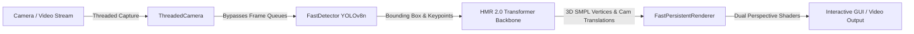

# 4D-Humans Realtime: High-FPS 3D Human Mesh Recovery & Tracking

[](https://github.com/Shreyas-cpu/4D-Humans-Realtime)
[](https://www.python.org/downloads/release/python-3100/)
[](https://pytorch.org/)
[](LICENSE.md)
[](https://arxiv.org/pdf/2305.20091.pdf)
[](https://shubham-goel.github.io/4dhumans/)
[](https://colab.research.google.com/drive/1Ex4gE5v1bPR3evfhtG7sDHxQGsWwNwby?usp=sharing)
[](https://huggingface.co/spaces/brjathu/HMR2.0)

> **4D-Humans Realtime** is an optimized, low-latency version of **4D-Humans (HMR 2.0)** engineered for live camera feeds, video processing, and interactive 3D human pose and shape estimation.


---

## ⚡ What's New & Key Improvements

| Feature | Original 4D-Humans | 4D-Humans Realtime |
| :--- | :--- | :--- |
| **Live Webcam / Video Stream** | Offline batch processing | **Real-time 0ms latency** threaded stream |
| **Bounding Box Detector** | Heavy ViTDet (~150–200ms) | **YOLOv8n (~7.5ms)** + RegNetY + ViTDet |
| **Webcam Mirroring** | Inverted / Not supported | **Natural Mirror Mode** (`--mirror` / `--no_mirror`) |
| **Coordinate Space Alignment** | Inverted X translation bugs | **Fixed True-X Spatial Alignment** |
| **Aspect Ratio Preservation** | Fixed 256x256 square render | **Auto-detects & preserves native camera aspect ratio** |
| **Multi-Perspective Visualization** | Single view render | **Dual View: Front Overlay + 3D Rotatable Side View** |
| **GPU Optimization** | Standard PyTorch execution | **FP16 + TF32 + cuDNN Benchmark acceleration** |
| **Asset Downloaders** | Manual Dropbox/gdown downloads | **High-speed multi-threaded / HF parallel downloaders** |

---

## 🚀 Quickstart & Installation

### 1. Clone & Set Up Environment

```bash
git clone https://github.com/Shreyas-cpu/4D-Humans-Realtime.git
cd 4D-Humans-Realtime

# Create conda environment (Python 3.10 recommended)
conda create --name 4D-humans python=3.10 -y
conda activate 4D-humans

# Install PyTorch with CUDA
pip install torch torchvision --index-url https://download.pytorch.org/whl/cu121

# Install project dependencies
pip install -e .[all]
pip install ultralytics pyrender trimesh
```

### 2. Download Model Checkpoints & SMPL Data

All primary checkpoints (HMR 2.0) will be downloaded automatically the first time you run the script.

For high-speed asset retrieval, use the included parallel download utilities:
```bash
# Download SMPL data and model checkpoints rapidly
python fast_parallel_downloader.py
```

> **SMPL Neutral Model Note:** You will need `basicModel_neutral_lbs_10_207_0_v1.0.0.pkl` from the [SMPLify website](http://smplify.is.tue.mpg.de). Place the file into `./data/`.

---

## 🎥 Running Real-Time Inference

### 1. Live Webcam Feed (Interactive Mirror Mode)
Run the real-time engine directly on your webcam with live side-by-side rendering:
```bash
python fast_realtime_feed.py --source 0
```
- **Mirror Mode**: Enabled by default on camera `0` for natural interactive movement (moving left moves mesh left).
- **Dual View**: Displays Front Overlay alongside a +45° angled 3D side perspective in real time.

### 2. Run on a Video File
Process any recorded video file with YOLOv8n detection and export the result:
```bash
python fast_realtime_feed.py \
    --source example_data/videos/gymnasts.mp4 \
    --save_video output_rendered.mp4 \
    --rot_angle 45
```

### 3. Key CLI Arguments

| Argument | Type | Default | Description |
| :--- | :--- | :--- | :--- |
| `--source` | `str` | `0` | Camera device index (`0`, `1`) or path to video file (`.mp4`, `.avi`, `.mov`) |
| `--mirror` | `flag` | `True` for cam | Enable horizontal mirror flip for natural webcam interaction |
| `--no_mirror` | `flag` | `False` | Disable mirror flip (raw camera view) |
| `--detector` | `str` | `yolo` | Object detector backend: `yolo` (ultra-fast), `regnety`, or `vitdet` |
| `--det_interval` | `int` | `2` | Run detector every *N* frames to maximize FPS |
| `--target_height` | `int` | `480` | Target render height (aspect ratio is automatically preserved) |
| `--side_view` | `flag` | `True` | Render dual perspective (Front Overlay + Side 3D View) |
| `--rot_angle` | `float` | `45.0` | 3D viewing angle in degrees for side view renderer |
| `--save_video` | `str` | `None` | Path to save output video (`.mp4`) |
| `--headless` | `flag` | `False` | Run in headless mode without GUI window |

---

## 🛠️ Offline Processing & Original Capabilities

### Run Batch Demo on Image Folders
Run HMR 2.0 on a directory of images:
```bash
python demo.py \
    --img_folder example_data/images \
    --out_folder demo_out \
    --batch_size=48 \
    --side_view \
    --save_mesh \
    --full_frame
```

### Video Tracking with PHALP
Track people across frames:
```bash
pip install git+https://github.com/brjathu/PHALP.git
python track.py video.source="example_data/videos/gymnasts.mp4"
```

### Training & Evaluation
To train and evaluate HMR 2.0:
```bash
# Training
bash fetch_training_data.sh
python train.py exp_name=hmr2 data=mix_all experiment=hmr_vit_transformer trainer=gpu launcher=local

# Evaluation
python eval.py --dataset 'H36M-VAL-P2,3DPW-TEST,LSP-EXTENDED,POSETRACK-VAL,COCO-VAL'
```

---

## 🏗️ Architecture & Pipeline Overview



1. **`ThreadedCamera`**: Captures raw camera buffer in a non-blocking background thread with instant mirror transformation.
2. **`FastDetector`**: Extracts high-confidence human bounding boxes in sub-10ms latency.
3. **`HMR 2.0`**: Predicts 3D mesh vertices, pose, shape, and camera translation parameters ($T_x, T_y, T_z$).
4. **`FastPersistentRenderer`**: Offscreen PyRender renderer using cached scenes and lighting to produce real-time front overlays and side-angle 3D reconstructions.

---

## 📜 Citation & Credits

This project builds upon the original work by Goel et al.:

```bibtex
@inproceedings{goel2023humans,
    title={Humans in 4{D}: Reconstructing and Tracking Humans with Transformers},
    author={Goel, Shubham and Pavlakos, Georgios and Rajasegaran, Jathushan and Kanazawa, Angjoo and Malik, Jitendra},
    booktitle={ICCV},
    year={2023}
}
```

### Acknowledgements
- Original 4D-Humans by [Shubham Goel et al.](https://github.com/shubham-goel/4D-Humans)
- [Ultralytics YOLOv8](https://github.com/ultralytics/ultralytics) for real-time person detection
- [PyRender](https://github.com/mmatl/pyrender) & [Trimesh](https://github.com/mikedh/trimesh) for 3D visualization
